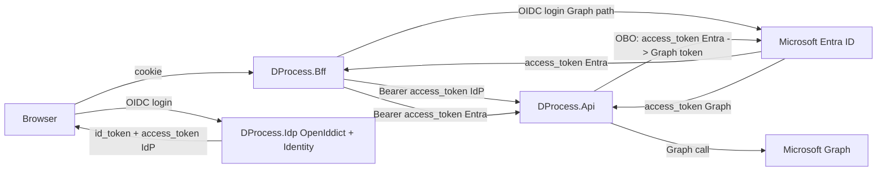
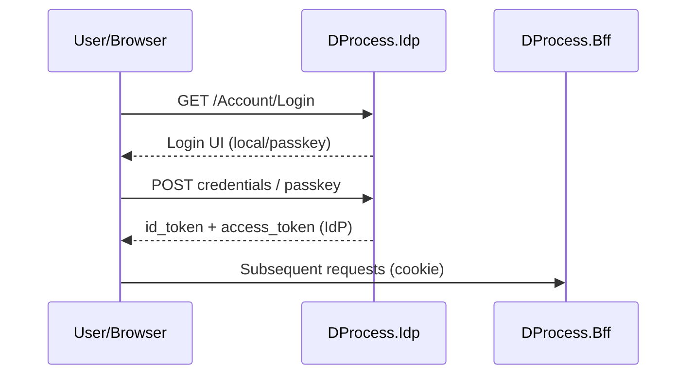
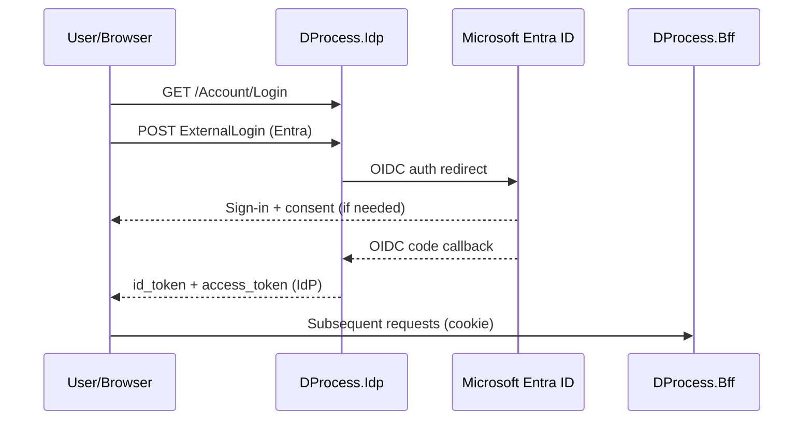
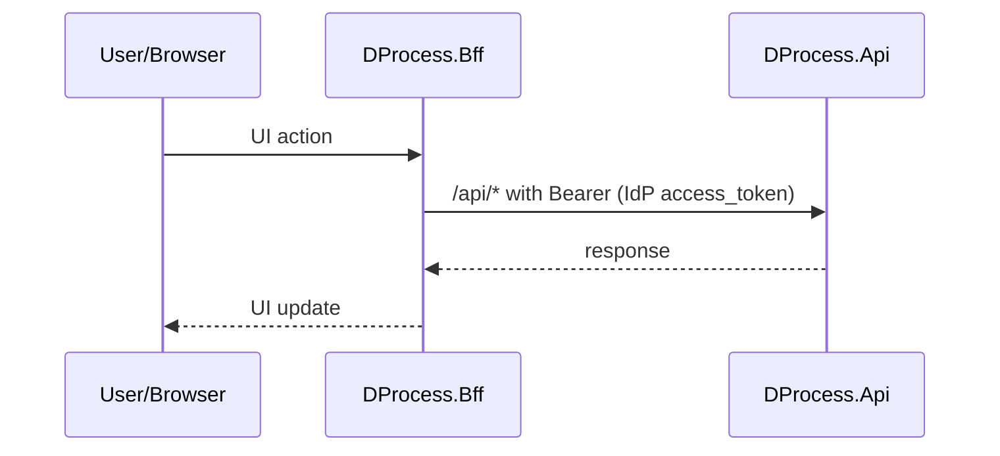
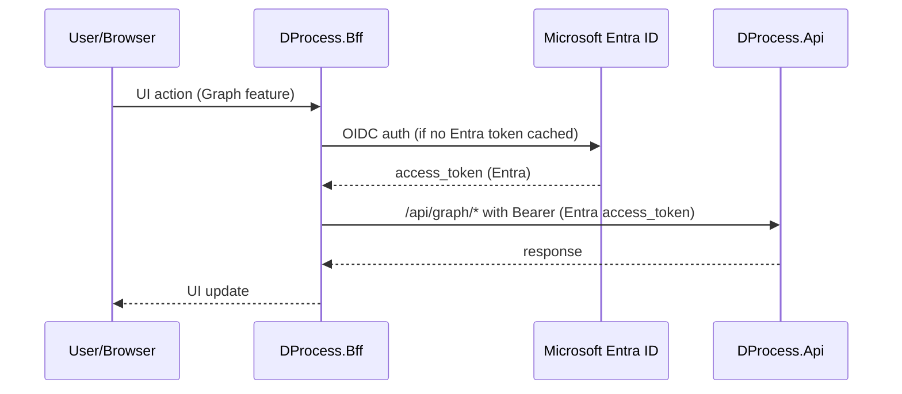
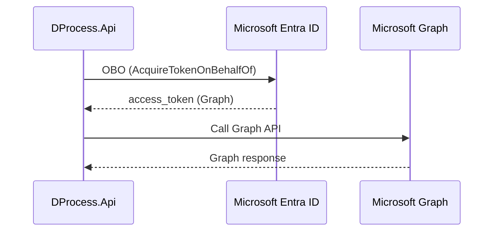
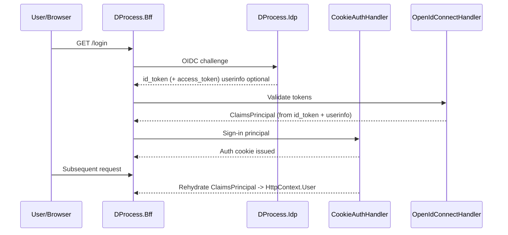
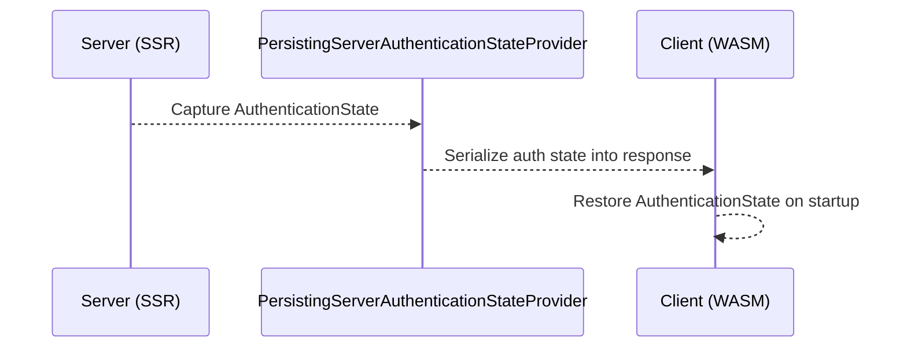
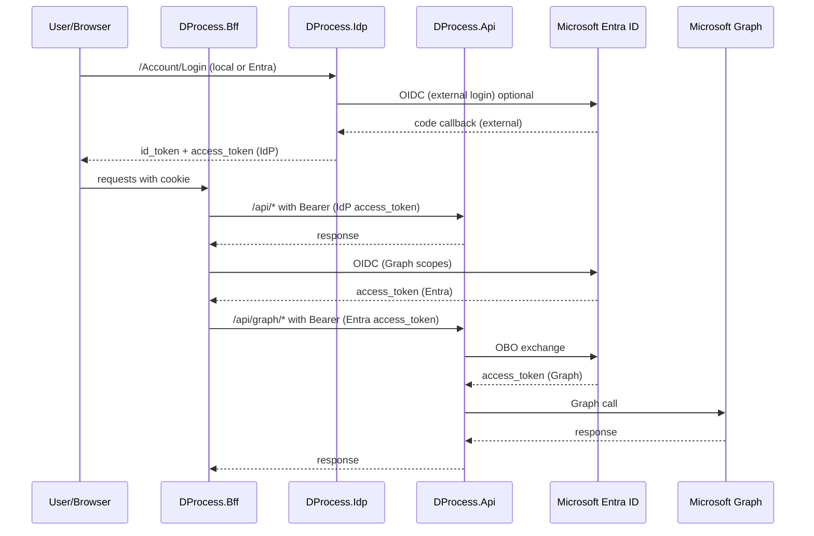

# Request Flows — demo4.2 (IdP + BFF + API + Graph)

This document illustrates all request flows in the demo4.2 architecture using:
- An overview **data‑flow diagram** (DFD)
- **Flow cards** (compact bullets)
- **Sequence diagrams** (Mermaid)
- A single **mega‑diagram** (Mermaid)

---

## 1) Overview DFD (token map)

Legend:
- **IdP tokens** = OpenIddict‑issued, used for local API authorization + permission claims.
- **Entra tokens** = Entra‑issued, required for Graph OBO.
- **API auth** = two JWT bearer schemes with **per‑route policies** (`/api/*` → OpenIddict, `/api/graph/*` → Entra).
- **RBAC** = local `permission` claims apply to OpenIddict endpoints; Entra endpoints require either scope-only auth or permission enrichment.

---

## 2) Flow cards (compact descriptions)

**Flow A — Local login (OpenIddict)**
- Trigger: user signs in with local username/password or passkey
- Sequence: Browser → IdP → Browser (IdP tokens) → BFF (cookie)
- Tokens: `id_token` + `access_token` issued by **IdP**
- Authority: **OpenIddict**

**Flow B — External login via Entra (through IdP)**
- Trigger: user chooses “Microsoft Entra ID” on IdP login page
- Sequence: Browser → IdP → Entra → IdP → Browser → BFF
- Tokens: `id_token` + `access_token` issued by **IdP** (after external login)
- Authority: **OpenIddict**

**Flow C — BFF → API (local permissions)**
- Trigger: app calls `/api/*` for local features
- Sequence: Browser → BFF → API
- Tokens: `access_token` issued by **IdP**
- Authority: **OpenIddict**
- Auth policy: **OpenIddict scheme** + local `permission` claims

**Flow D — Graph path: BFF → API (Entra token)**
- Trigger: app calls `/api/graph/*` (Graph‑enabled path)
- Sequence: Browser → BFF (gets Entra token) → API
- Tokens: `access_token` issued by **Entra**
- Authority: **Entra**
- Auth policy: **Entra scheme**; RBAC is **scopes only** unless you enrich permissions

**Flow E — API → Graph (OBO)**
- Trigger: API receives Entra access token for Graph path
- Sequence: API → Entra (OBO exchange) → API → Graph
- Tokens: incoming **Entra** access token; outgoing **Graph** access token
- Authority: **Entra**

---

## 3) Sequence diagrams (Mermaid)

### Flow A — Local login (OpenIddict)

### Flow B — External login via Entra (through IdP)

### Flow C — BFF → API (local permissions)

### Flow D — Graph path: BFF → API (Entra token)

### Flow E — API → Graph (OBO)

---

## 4) ClaimsPrincipal construction in BFF

### Summary
The BFF’s `ClaimsPrincipal` is created by the **OIDC handler** (from ID token + UserInfo), then persisted by the **cookie auth handler**. Blazor uses that cookie principal for SSR/InteractiveAuto.  
During prerendering, the **server auth state is serialized** and passed to the WASM client via `PersistingServerAuthenticationStateProvider`, so the client initializes with the same authenticated user **without re-authenticating**.

### Sequence diagram — BFF ClaimsPrincipal lifecycle

### Note (Option A)
Permission claims must be present in **ID token** or **UserInfo**, and the BFF must map them into the auth principal (so UI policies can evaluate `permission` claims).

### SSR → WASM auth state transfer (InteractiveAuto)

---

## 5) Mega‑diagram (all flows in one)

Note: `/api/*` routes enforce the **OpenIddict** scheme + local `permission` policies; `/api/graph/*` routes enforce the **Entra** scheme and **do not** see local permissions unless you enrich the principal.
