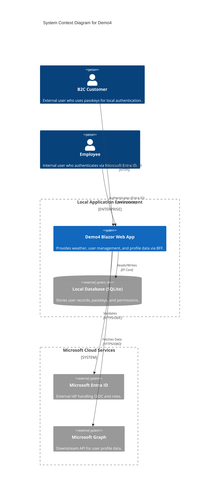
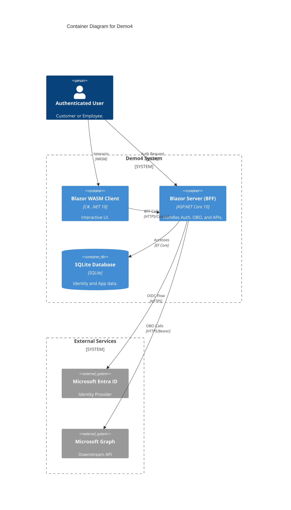
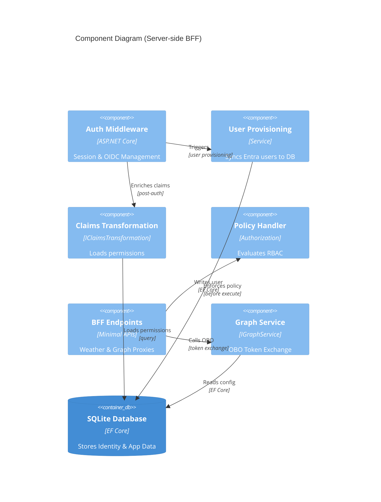

# Demo4 Architecture – Entra ID Integration

This document visualizes the architecture of Demo4 using the **C4 Model** (System Context, Container, and Component levels).

## 1. System Context Diagram (Level 1)

The System Context diagram provides a high-level view of how users interact with the application and how the application interacts with external services.

## 2. Container Diagram (Level 2)

The Container diagram shows the high-level technology choices and how the Blazor Web App is split between Server-side and Client-side (WASM).

## 3. Component Diagram (Level 3 - Server-side)

This diagram focuses on the internal components of the **Server-side (BFF)** container, specifically the authentication and authorization pipeline.

## Architecture Summary

- **Hybrid Authentication:** Supports both Local Identity (for Customers using Passkeys) and Microsoft Entra ID (for Employees).
- **Auto-Provisioning:** User records are automatically created in the local database during the OIDC `OnTokenValidated` event.
- **Unified Permission Model:** Whether a user is local or from Entra, they are mapped to local roles, and `IClaimsTransformation` loads their `permission` claims for authorization.
- **BFF Pattern:** The client WASM never holds access tokens. It authenticates with the server using secure, HttpOnly cookies. The server performs token exchange (OBO) to call downstream APIs like Microsoft Graph.
