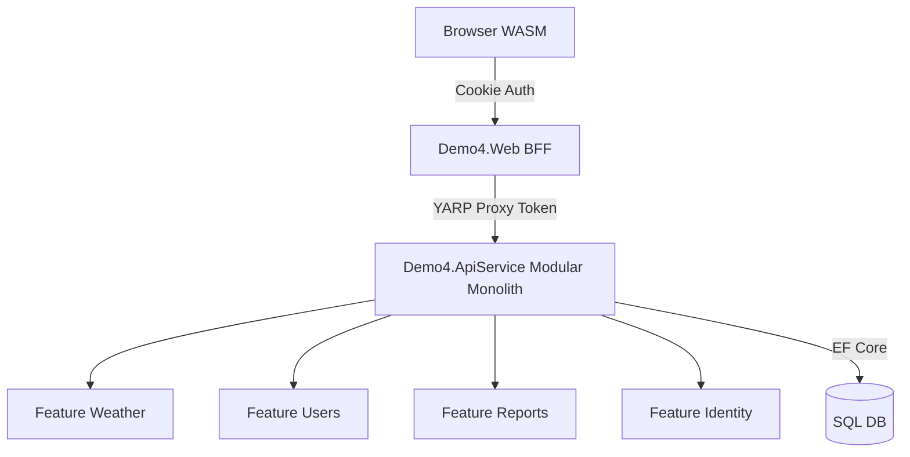

# Demo 4 Evolution Plan: Distributed Modular Monolith

**Date:** January 9, 2026
**Context:** Evolving Demo 4 to incorporate patterns from Demo 4.1 (Aspire, YARP, Modular Monolith) while retaining hybrid identity management.

## 1. Comparative Analysis with Demo 4.1

The architectural evolution marks a transition from a **Hybrid Monolith** to a **Distributed Modular Monolith**.

### System Topology & Deployment
*   **Demo 4 (Current):** Traditional single-process monolith. UI (Blazor) and Business Logic (Minimal APIs) share memory space and database context.
*   **Target State:** Cloud-native topology orchestrated by **.NET Aspire**:
    *   **AppHost:** Orchestrator managing service discovery/lifecycle.
    *   **Frontend (BFF):** Dedicated head for UI and security negotiation (Blazor + YARP).
    *   **ApiService (Backend):** Stateless API focusing purely on domain logic, organized by feature.

### Backend-for-Frontend (BFF) Pattern
*   **Current:** Internal BFF (Minimal APIs inside Blazor project).
*   **Target:** Transparent Proxy BFF using **YARP**.
    *   WASM client calls `https://frontend/api/proxy/...`
    *   Frontend project performs **Cookie-to-Bearer exchange**.
    *   Backend services are protected by standardized JWT/Scope validation (or network trust).

---

## 2. Architecture: The "Decomposed" Modular Monolith

To use YARP and Aspire effectively while keeping the benefits of a monolith during early development, we split the application into two logical processes.

### Proposed Structure



### Components Role

1.  **Demo4.Web (The Frontend/BFF):**
    *   **Role:** UI (Blazor), Authentication (Cookies, OAuth Handshakes), Routing.
    *   **YARP:** Maps `/api/*` requests to the ApiService.
    *   **Security:** Keeps tokens (Access/Refresh) on server; Browser holds secure HttpOnly cookie.

2.  **Demo4.ApiService (The Modular Monolith):**
    *   **Role:** Pure API. Stateless.
    *   **Structure:** Organized by **Vertical Slices** (Features) instead of layers.
    *   **Data Access:** Centralized DB Context (Modular Monolith style) initially, splitting later if needed.

---

## 3. Implementation: Vertical Slices

We will move away from technical layering (`Controllers`, `Services`, `Data`) toward functional slicing.

**Future Structure (Demo4.ApiService):**
```text
Demo4.ApiService/
├── Features/
│   ├── Weather/
│   │   ├── WeatherForecast.cs          // Domain Model
│   │   ├── GetWeatherQuery.cs          // Business Logic
│   │   └── WeatherEndpoints.cs         // Minimal API Definitions
│   ├── Identity/
│   │   ├── ExternalProvisioning.cs     // Generalized Provisioning Logic
│   │   └── IdentityEndpoints.cs
│   └── Reports/
└── Shared/                             // Only truly common infrastructure
```

**Strategic Benefit:**
This structure prepares for microservices. Extracting a module (e.g., `Reports`) into a standalone service becomes a simple copy-paste operation + YARP config update.

---

## 4. Identity Strategy: Unifying Enterprise & Social

To support both Microsoft Entra ID (Enterprise) and Social Login (Gmail/Facebook) while maintaining complex local user management:

### The Mental Model
*   **Entra ID:** Optimized for B2B/Org identity.
*   **Social:** Optimized for B2C identity.
*   **Application View:** Both are **External Identity Providers (IdPs)**.

### The Abstraction: Hybrid Store
We will generalize `IEntraUserProvisioningService` to `IExternalIdentityProvisioningService`.

**Logic Flow:**
1.  **Input:** `ClaimsPrincipal` + `ProviderName` (e.g., "MicrosoftEntra", "Google").
2.  **Resolution:** Extract unique stable Key (Entra `oid` or OIDC `sub`).
3.  **Lookup:** Check `AspNetUserLogins` (standard Identity table).
4.  **Decision:**
    *   *Match found:* Log in existing local user.
    *   *No match:* **Auto-provision** local `ApplicationUser`, assign default roles, and link the login.

**Result:** A unified Permission/RBAC system that relies on the local User ID, regardless of the authentication source.

---

## 5. Roadmap

1.  **Refactor Identity:** Rename and generalize `EntraUserProvisioningService` to `ExternalIdentityService`. Make it provider-agnostic.
2.  **Project Split:** Create `Demo4.AppHost`, `Demo4.Web`, and `Demo4.ApiService`.
3.  **Move & Slice:** Migrate logic into `Demo4.ApiService/Features/*`.
4.  **Wire up YARP:** Configure `Demo4.Web` to proxy requests.
