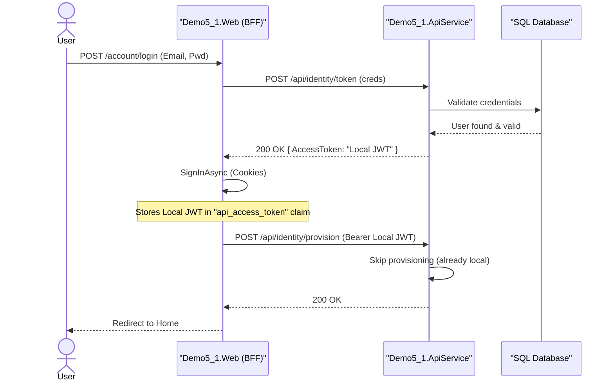
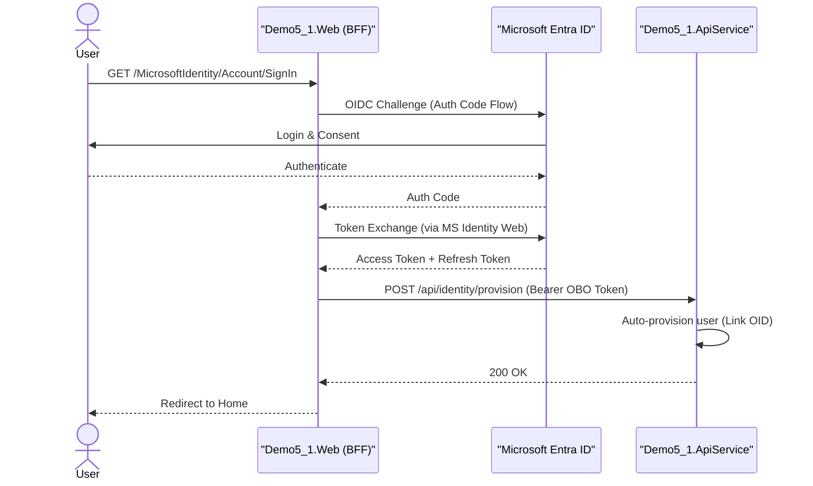
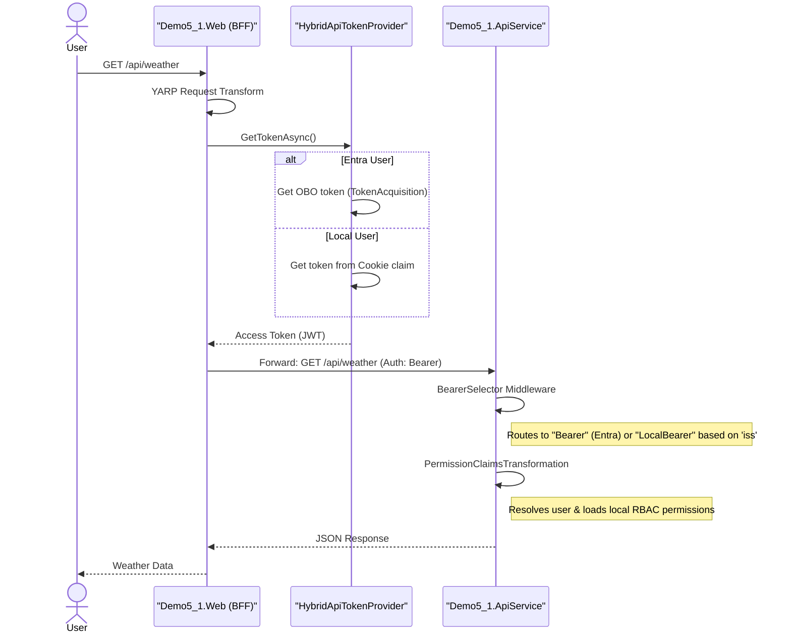
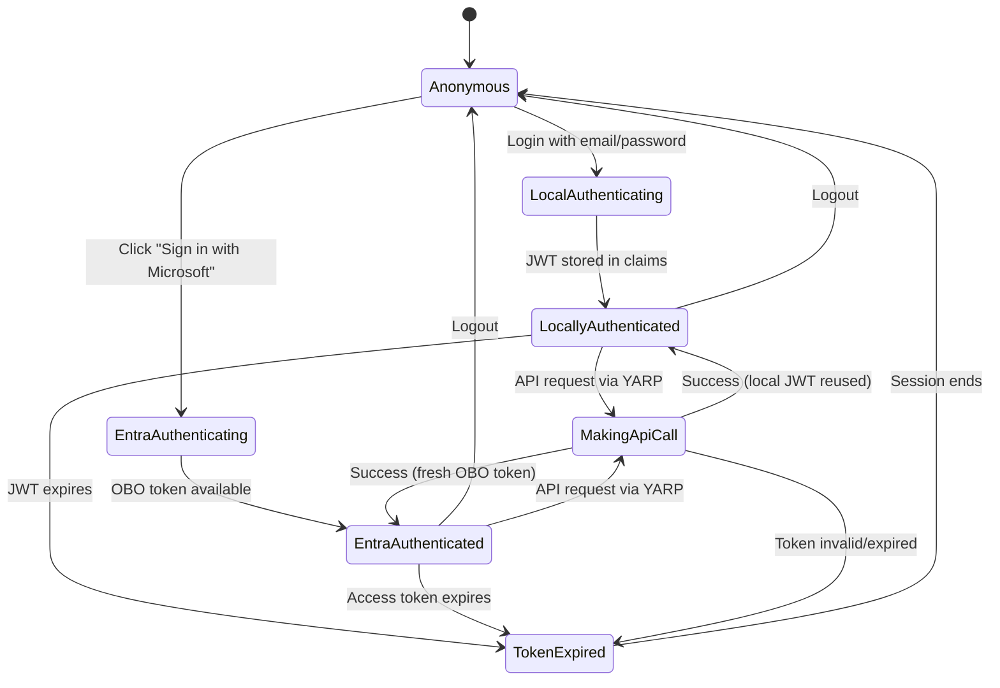
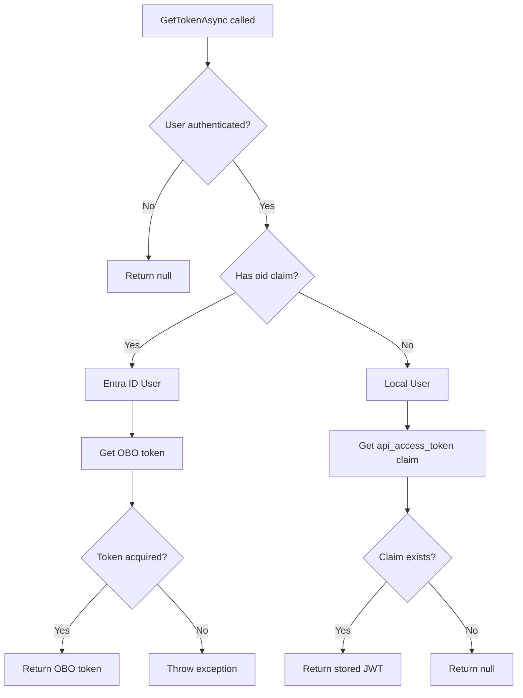
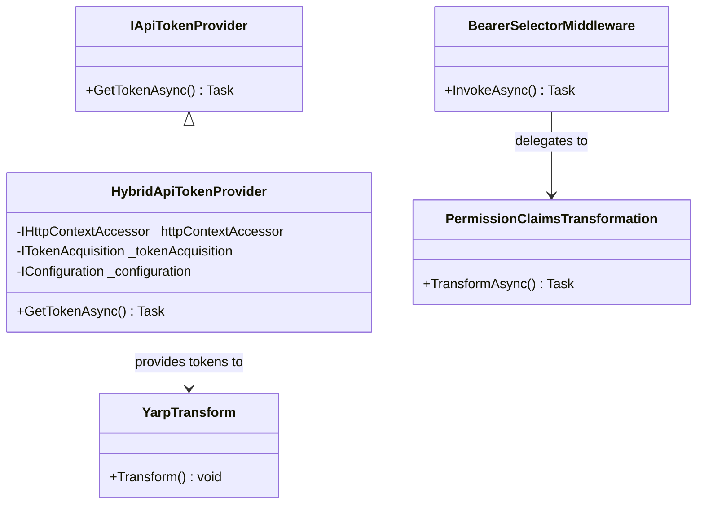
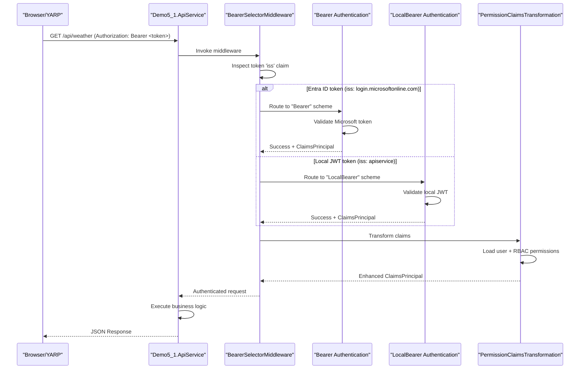

# Demo 5.1 Authentication & Request Flows

This document details the sequence of events for authentication and API communication in the distributed modular monolith.

## 1. Local Authentication Flow

Used when a user signs in with a local account (email/password).

## 2. Microsoft Entra ID Flow (OBO)

Used when a user signs in via Entra ID. The BFF uses the On-Behalf-Of (OBO) flow to call the API.

## 3. Protected API Request (Unified YARP Proxy)

All browser-to-API requests pass through YARP, which attaches the appropriate token regardless of the identity provider.

## 4. Authentication State Diagram

Shows the different authentication states a user can transition between in the hybrid system.

## 5. Token Provider Decision Flow

Illustrates the logic in `HybridApiTokenProvider.GetTokenAsync()` for determining which token to use.

## 6. Authentication Component Diagram

Shows the key classes, interfaces, and their relationships in the authentication system.

## 7. Multi-Scheme Authentication Flow

Detailed sequence showing how the API service handles both Bearer schemes and token routing.

## 8. Token Lifecycle Diagram

Shows the complete lifecycle of tokens in the hybrid authentication system.

```mermaid
flowchart TD
    subgraph "Local Authentication"
        A1[User Login] --> B1[Call /api/identity/token]
        B1 --> C1[JWT Created by ApiService]
        C1 --> D1[Stored in 'api_access_token' claim]
        D1 --> E1[Persisted in Cookie Session]
        E1 --> F1[Reused for all API calls]
        F1 --> G1{JWT Expires?}
        G1 -->|No| F1
        G1 -->|Yes| H1[User must re-login]
    end
    
    subgraph "Entra ID Authentication"
        A2[User Login] --> B2[OIDC Code Flow]
        B2 --> C2[Access + Refresh tokens stored]
        C2 --> D2[API Call requested]
        D2 --> E2[OBO Token acquired fresh]
        E2 --> F2[Token cached briefly]
        F2 --> G2[Used for API call]
        G2 --> H2{Token expires soon?}
        H2 -->|No| I2[Reuse cached token]
        H2 -->|Yes| J2[Acquire new OBO token]
        J2 --> F2
    end
    
    subgraph "Token Validation"
        V1[API receives Bearer token] --> V2{Which issuer?}
        V2 -->|Microsoft| V3[Validate via Microsoft scheme]
        V2 -->|ApiService| V4[Validate via LocalBearer scheme]
        V3 --> V5[Load permissions from DB]
        V4 --> V5
        V5 --> V6[Authorize request]
    end
```

