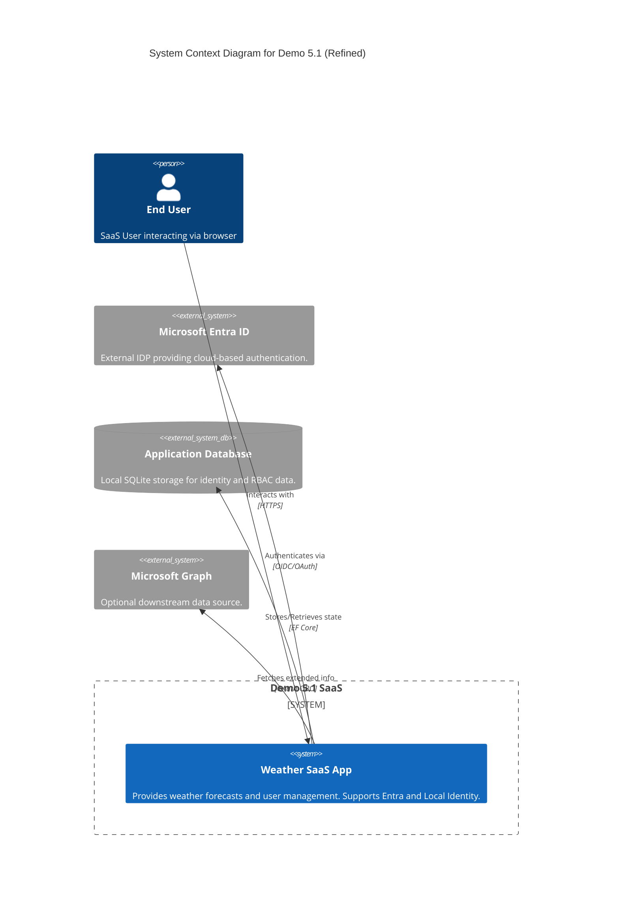

# C1 — System Context (Mermaid)

```mermaid
C4Context
    title System Context Diagram for Demo 5.1 (Refined)

    Person(user, "End User", "SaaS User interacting via browser")

    System_Boundary(saas_boundary, "Demo 5.1 SaaS") {
        System(saas, "Weather SaaS App", "Provides weather forecasts and user management. Supports Entra and Local Identity.")
    }

    System_Ext(entra, "Microsoft Entra ID", "External IDP providing cloud-based authentication.")
    SystemDb_Ext(db, "Application Database", "Local SQLite storage for identity and RBAC data.")
    System_Ext(graph, "Microsoft Graph", "Optional downstream data source.")

    Rel(user, saas, "Interacts with", "HTTPS")
    Rel(saas, entra, "Authenticates via", "OIDC/OAuth")
    Rel(saas, db, "Stores/Retrieves state", "EF Core")
    Rel(saas, graph, "Fetches extended info", "OAuth OBO")
```
