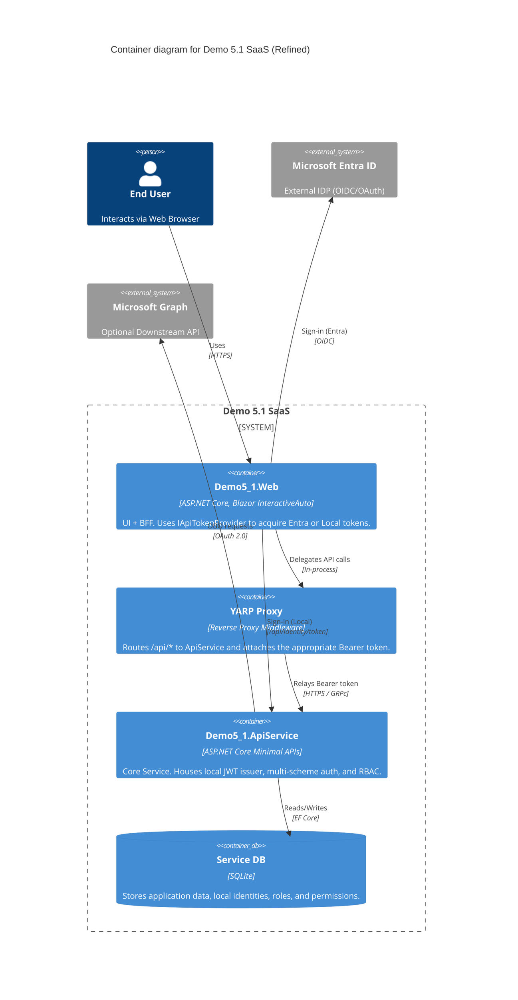

# C2 — Containers (Mermaid)

```mermaid
C4Container
    title Container diagram for Demo 5.1 SaaS (Refined)

    Person(user, "End User", "Interacts via Web Browser")

    System_Boundary(saas, "Demo 5.1 SaaS") {
        Container(web, "Demo5_1.Web", "ASP.NET Core, Blazor InteractiveAuto", "UI + BFF. Uses IApiTokenProvider to acquire Entra or Local tokens.")
        Container(yarp, "YARP Proxy", "Reverse Proxy Middleware", "Routes /api/* to ApiService and attaches the appropriate Bearer token.")
        Container(api, "Demo5_1.ApiService", "ASP.NET Core Minimal APIs", "Core Service. Houses local JWT issuer, multi-scheme auth, and RBAC.")
        ContainerDb(db, "Service DB", "SQLite", "Stores application data, local identities, roles, and permissions.")
    }

    System_Ext(entra, "Microsoft Entra ID", "External IDP (OIDC/OAuth)")
    System_Ext(graphApi, "Microsoft Graph", "Optional Downstream API")

    Rel(user, web, "Uses", "HTTPS")
    Rel(web, entra, "Sign-in (Entra)", "OIDC")
    Rel(web, api, "Sign-in (Local)", "/api/identity/token")
    Rel(web, yarp, "Delegates API calls", "In-process")
    Rel(yarp, api, "Relays Bearer token", "HTTPS / GRPc")
    Rel(api, db, "Reads/Writes", "EF Core")
    Rel(api, graphApi, "OBO requests", "OAuth 2.0")
```
