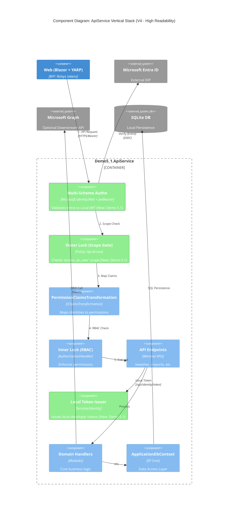

# C3 — ApiService Components (Mermaid)

```mermaid
C4Component
    title Component Diagram: ApiService Vertical Stack (V4 - High Readability)

    %% TOP: Entry Points
    Container(web, "Web (Blazor + YARP)", "BFF: Relays tokens")
    System_Ext(entra, "Microsoft Entra ID", "External IDP")

    Container_Boundary(api_boundary, "Demo5_1.ApiService") {
        %% Pipeline stack (Sequential)
        Component(authn, "Multi-Scheme Authn", "Microsoft.Identity.Web + JwtBearer", "Validates Entra vs Local JWT (New: Demo 5.1)")
        Component(scopeGate, "Outer Lock (Scope Gate)", "Policy: Api.Access", "Checks 'access_as_user' scope (New: Demo 5.1)")
        Component(claimsTx, "PermissionClaimsTransformation", "IClaimsTransformation", "Maps identities to permissions")
        Component(permHandler, "Inner Lock (RBAC)", "AuthorizationHandler", "Enforces permissions")
        
        Component(endpoints, "API Endpoints", "Minimal APIs", "/weather, /reports, etc.")

        %% Logic & Issues
        Component(localIssuer, "Local Token Issuer", "Services/Identity", "Issues local developer tokens (New: Demo 5.1)")
        Component(domainHandlers, "Domain Handlers", "Modules", "Core business logic")
        Component(db, "ApplicationDbContext", "EF Core", "Data Access Layer")
    }

    %% BOTTOM: Storage & Downstream
    System_Ext(graphApi, "Microsoft Graph", "Optional Downstream API")
    SystemDb_Ext(sqlite, "SQLite DB", "Local Persistence")

    %% RELATIONSHIPS
    Rel(web, authn, "1. API Request", "HTTPS/Bearer")
    Rel_L(authn, entra, "Verify (Entra)", "OIDC")
    
    %% MAIN PIPELINE (UNIDIRECTIONAL DOWN)
    Rel(authn, scopeGate, "2. Scope Check")
    Rel(scopeGate, claimsTx, "3. Map Claims")
    Rel(claimsTx, permHandler, "4. RBAC Check")
    Rel(permHandler, endpoints, "5. Execute")

    %% LOGIC BRANCHES
    Rel(endpoints, localIssuer, "Issue Token", "/api/identity/token")
    Rel(endpoints, domainHandlers, "Process")
    Rel(domainHandlers, db, "I/O")
    
    %% FORCING DOWNWARD ANCHORING
    Rel_D(domainHandlers, graphApi, "OBO Call", "OAuth")
    Rel_D(db, sqlite, "SQL Persistence")

    %% STYLING FOR DEMO 5.1 FOCUS
    UpdateElementStyle(authn, $bgColor="#90EE90", $textColor="#000", $borderColor="#333")
    UpdateElementStyle(scopeGate, $bgColor="#90EE90", $textColor="#000", $borderColor="#333")
    UpdateElementStyle(localIssuer, $bgColor="#90EE90", $textColor="#000", $borderColor="#333")
```
