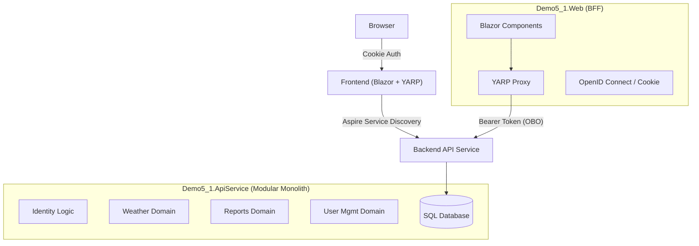

# Demo 5.1: Distributed Modular Monolith with Aspire & YARP

## Goal
Evolve the "Downstream API" pattern (Demo 5) into a production-grade **Distributed Modular Monolith** architecture. This demo introduces **.NET Aspire** for orchestration and **YARP (Yet Another Reverse Proxy)** to simplify the Backend-for-Frontend (BFF), effectively removing business logic from the presentation layer.

## Architecture

This demo creates a "Cloud-Native" topology on your local machine:

### Components

| Project             | Role           | Tech Stack              | Description                                                                 |
| :------------------ | :------------- | :---------------------- | :-------------------------------------------------------------------------- |
| **AppHost**         | Orchestrator   | .NET Aspire             | Manages startup, environment variables, and service discovery.              |
| **Web**             | Frontend / BFF | Blazor Interactive Auto | Handles UI and Auth. Proxies API calls. **No business logic.**              |
| **ApiService**      | Backend        | ASP.NET Core Web API    | **Modular Monolith**. Contains all domain logic (Identity, Weather, Users). |
| **ServiceDefaults** | Defaults       | OpenTelemetry           | Shared configuration for health checks and observability.                   |

## Key Concepts

### 1. YARP as the "Smart Glue"
In Demo 5, the Frontend had specific C# Controllers/Services to call the Downstream API.
In Demo 5.1, we delete those wrappers. The Frontend uses **YARP** to forward any request matching `/api/*` directly to the Backend.
- **Benefit:** The Frontend doesn't need to know the Backend's schema.
- **Security:** The Proxy Middleware automatically attaches the user's **Access Token** (acquired via OBO) to the forwarded request.

### 2. Identity "Shift Left" (to the Backend)
In previous demos, the Frontend owned the User Database (`ApplicationDbContext`).
Now, the **Backend (`ApiService`)** owns the data.
- **Frontend duty:** Authenticate user (Cookies), acquire token.
- **Backend duty:** Validate token, manage users, authorize based on Claims/permissions.

### 3. Aspire Orchestration
No more running multiple terminal windows. `Demo5_1.AppHost` runs everything. Service Discovery (`http://apiservice`) handles connection strings dynamically.

## Prerequisites

1.  **Entra ID Configuration** (Same as Demo 5):
    - Client App (BFF)
    - Protected API (Backend)
    - Scope: \Forecast.Read\ (mapped in \ppsettings.json\)

2.  **Tools**:
    - .NET 10 SDK
    - Visual Studio 2022 / VS Code with C# Dev Kit

## Configuration (Important!)

You must copy your Entra ID settings from `demo5/Demo5.DownstreamApi/appsettings.json` to **demo5.1/Demo5_1.Web/appsettings.json**.

**\Demo5_1.Web/appsettings.json\**:
`json
"AzureAd": {
  "ClientId": "...",
  "ClientSecret": "...",
  "TenantId": "..."
},
"ApiService": {
  "Scopes": [ "api://<your-api-client-id>/Forecast.Read" ]
}
`

**\Demo5_1.ApiService/appsettings.json\**:
`json
"AzureAd": {
  "ClientId": "...",
  "TenantId": "..."
}
`

## How to Run

1.  **Open Solution:** ``demo5.1/Demo5_1.sln`
2.  **Startup Project:** Set `Demo5_1.AppHost` as the startup project.
3.  **Run:** Press F5.
4.  **Aspire Dashboard:** A dashboard will open. Click the endpoint for `webfrontend` (`https://localhost:...`) to launch the app.

## Migration Guide (From Demo 5)

If you are comparing with Demo 5:
- **Moved:** `Data/` and `Authorization/` moved from Frontend -> Backend.
- **Deleted:** `Controllers/` in Frontend (replaced by YARP).
- **Added:** `Demo5_1.Web.Services.PersistingServerAuthenticationStateProvider` (fetches permissions from Backend API during prerendering).
