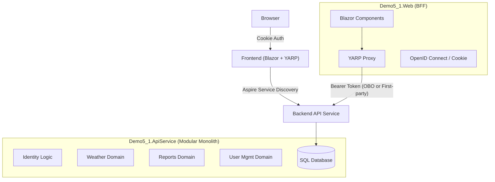

# Demo 5.1: Distributed Modular Monolith with Aspire & YARP

## Goal
Evolve the "Downstream API" pattern (Demo 5) into a production-grade **Distributed Modular Monolith** architecture. This demo introduces **.NET Aspire** for orchestration and **YARP (Yet Another Reverse Proxy)** to simplify the Backend-for-Frontend (BFF), effectively removing business logic from the presentation layer.

## Architecture

This demo creates a "Cloud-Native" topology on your local machine:



  For C4 diagrams (C1/C2/C3), see `.docs/diagrams/`.

### Components

| Project             | Role           | Tech Stack              | Description                                                                 |
| :------------------ | :------------- | :---------------------- | :-------------------------------------------------------------------------- |
| **AppHost**         | Orchestrator   | .NET Aspire             | Manages startup, environment variables, and service discovery.              |
| **Web**             | Frontend / BFF | Blazor Interactive Auto | Handles UI and Auth. Proxies API calls. **No business logic.**              |
| **ApiService**      | Backend        | ASP.NET Core Web API    | **Modular Monolith**. Contains all domain logic (Identity, Weather, Users). |
| **ServiceDefaults** | Defaults       | OpenTelemetry           | Shared configuration for health checks and observability.                   |

## Key Concepts

### OAuth Scopes vs Local RBAC (Pragmatic Guide)

This demo intentionally uses *both* Microsoft Entra ID and local Identity/RBAC. They solve different problems at different layers.

#### Industry terms (what to call things)

- **Entra scopes** = OAuth 2.0 **scopes** (Microsoft also calls these **Delegated permissions** for an API). In tokens they appear as the `scp` claim.
- **Local RBAC** = application **RBAC** (roles + permissions), sometimes described as **permission-based RBAC** or **entitlements**.

#### What problem each solves

- **Scopes** (API permission contract): *Can this client obtain a token to call this API, and for which coarse capability?*
  - Operationally: consent, admin review, auditability, and least-privilege at the API boundary.
- **Local RBAC** (business authorization): *What can this user do inside our product/tenant?*
  - Operationally: fast permission changes, tenant-specific roles, fine-grained domain rules.

### The “two locks” model (recommended)

Treat authorization as two independent checks:

1. **Outer lock (platform/API boundary):** validate the access token *and* require a scope (or app-role) appropriate to the endpoint.
2. **Inner lock (business/domain):** require a local permission (RBAC) appropriate to the action.

Example intent:

- `GET /api/weather` requires scope `Forecast.Read` **and** local permission `weather.read`.

This is defense-in-depth: if a local permission check is accidentally missed on one endpoint, a scope gate can still block entire classes of calls.

### Multi-identity (Entra + local accounts)

Local RBAC should remain the stable, provider-agnostic authorization model.

- When the API is called using **OAuth access tokens**, it’s natural to enforce scopes.
- When the API is called using **cookies/session** (common in BFF), there is no `scp` claim; scope enforcement is typically not applicable.

This leads to a design choice for the “outer lock”: allow different credential types per tenant/client, or standardize on one API credential type.

#### Workshop choice: one API boundary (bearer tokens)

In a tenant where users can choose either Local Identity or Entra at login time, the *inner lock* (local RBAC) stays the same, but the *outer lock* depends on how the API is called.

In this workshop, we standardize on **bearer tokens** for calls to `ApiService`, regardless of how the user signed in.

What this gives you:

- One API entry contract: always `Authorization: Bearer ...`
- A consistent “outer lock” mechanism (token validation + coarse capability gate)
- A clean path to add future clients (mobile/CLI/partners) without changing the API boundary

##### Request flow (Entra sign-in)

1. User signs in to `Web` via Entra (cookie session).
2. `Web` acquires an Entra access token for `ApiService` (delegated/OBO) using configured scopes (example: `Forecast.Read`).
3. YARP forwards `/api/*` requests to `ApiService` and attaches the access token.
4. `ApiService` validates the token and checks scope(s) (outer lock), then evaluates local RBAC permission(s) (inner lock).

##### Request flow (Local Identity sign-in)

1. User signs in to `Web` using local Identity (cookie session).
2. `Web` obtains a **first-party access token** (JWT) for `ApiService` from your own issuer (commonly the `ApiService` itself or a dedicated auth/token endpoint).
3. YARP forwards `/api/*` requests to `ApiService` and attaches the first-party token.
4. `ApiService` validates the token (issuer/signature/audience) and applies a coarse capability gate (scope-like claim), then evaluates local RBAC permission(s).

##### API validation model

`ApiService` accepts bearer tokens from multiple trusted issuers:

- **Entra tokens** (issuer = Entra tenant, `scp` contains delegated scopes)
- **First-party tokens** (issuer = your SaaS/local issuer, contains a small set of scope-like capabilities)

Local RBAC remains the source of truth for business permissions in both cases.

Tradeoffs:

- You must implement token issuance/rotation for local identities (claim shape, lifetime, refresh strategy).

##### Alternatives (not used in this demo)

**BFF-as-boundary (API private):** simplest for browser-only apps, but harder to open the API to other clients later.


**Per-tenant outer locks:** avoid mixing “bearer for some tenants” and “cookies for others” unless you truly need it; it increases operational complexity and makes authorization harder to reason about.

**Rule of thumb:** in multi-identity SaaS, keep *business authorization* provider-agnostic (local RBAC), and prefer a single API boundary credential type unless you have a strong reason not to.

### Decision matrix: when to use scopes

| Situation                                                    | Use Entra scopes?   | Why                                                    |
| ------------------------------------------------------------ | ------------------- | ------------------------------------------------------ |
| One first-party web app → one API (same team, internal-only) | Maybe (minimal)     | Optional defense-in-depth + future-proofing            |
| Multiple clients (web + mobile + CLI) calling same API       | Yes                 | Least-privilege per client, clean contract             |
| Partner/external integrations                                | Yes                 | Consent/governance, auditability, blast-radius control |
| API used by other teams/orgs                                 | Yes                 | Strong boundary and operational clarity                |
| Fine-grained per-tenant business permissions (dozens+)       | No (use local RBAC) | Scopes don’t scale well for this                       |

### Real-life SaaS pattern (scopes small, RBAC rich)

Pragmatic SaaS setup:

- **Scopes (small set):** represent coarse API access tiers (often 1–5 scopes total).
  - Example: `access_as_user` (baseline), optionally `reports.read`, `billing.write`.
- **Local permissions (larger set):** represent product actions.
  - Example: `users.invite`, `reports.export`, `billing.issue-refund`, `integrations.manage`.

Then enforce:

- Scopes/App-roles: *who may call the API*.
- Local RBAC: *what the user may do inside the tenant*.

### 1. YARP as the "Smart Glue"
In Demo 5, the Frontend had specific C# Controllers/Services to call the Downstream API.
In Demo 5.1, we delete those wrappers. The Frontend uses **YARP** to forward any request matching `/api/*` directly to the Backend.
- **Benefit:** The Frontend doesn't need to know the Backend's schema.
- **Security:** The Proxy Middleware automatically attaches the user's **Access Token** (acquired via OBO) to the forwarded request.

### 2. Identity "Shift Left" (to the Backend)
In previous demos, the Frontend owned the User Database (`ApplicationDbContext`).
Now, the **Backend (`ApiService`)** owns the data.
- **Frontend duty:** Authenticate user (Cookies), acquire token.
- **Backend duty:** Validate token, manage users, authorize based on Claims/permissions.

### 3. Aspire Orchestration
No more running multiple terminal windows. `Demo5_1.AppHost` runs everything. Service Discovery (`http://apiservice`) handles connection strings dynamically.

## Prerequisites

1.  **Entra ID Configuration** (Same as Demo 5):
    - Client App (BFF)
    - Protected API (Backend)
    - Scope: `Forecast.Read` (mapped in `appsettings.json`)

2.  **Tools**:
    - .NET 10 SDK
    - Visual Studio 2022 / VS Code with C# Dev Kit

## Configuration (Important!)

You must copy your Entra ID settings from `demo5/Demo5.DownstreamApi/appsettings.json` to **demo5.1/Demo5_1.Web/appsettings.json**.

**Demo5_1.Web/appsettings.json**:
```json
"AzureAd": {
  "ClientId": "...",
  "ClientSecret": "...",
  "TenantId": "..."
},
"ApiService": {
  "Scopes": [ "api://<your-api-client-id>/Forecast.Read" ]
}
```

**Demo5_1.ApiService/appsettings.json**:
```json
"AzureAd": {
  "ClientId": "...",
  "TenantId": "..."
}
```

## How to Run

1.  **Open Solution:** `demo5.1/Demo5_1.sln`
2.  **Startup Project:** Set `Demo5_1.AppHost` as the startup project.
3.  **Run:** Press F5.
4.  **Aspire Dashboard:** A dashboard will open. Click the endpoint for `webfrontend` (`https://localhost:...`) to launch the app.

## Migration Guide (From Demo 5)

If you are comparing with Demo 5:
- **Moved:** `Data/` and `Authorization/` moved from Frontend -> Backend.
- **Deleted:** `Controllers/` in Frontend (replaced by YARP).
- **Added:** `Demo5_1.Web.Services.PersistingServerAuthenticationStateProvider` (fetches permissions from Backend API during prerendering).
