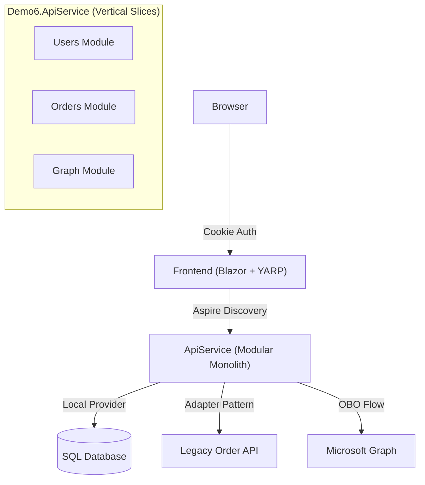

# Demo 6: The Multi-Tenant SaaS Monolith (Multi-Identity & Data Isolation)

## Goal
Transform the **Distributed Modular Monolith** from Demo 5.1 into a professional **SaaS platform**. This demo focuses on two critical "SaaS-Scale" challenges: **Data Isolation** (via Finbuckle) and **Identity-as-a-Setting**. You will establish a configuration-driven infrastructure that enables different customers (tenants) to have different identity providers and business rules, laying the foundation for the **Feature Flag Management** pattern in Demo 7.

## Architecture: The Multi-Tenant Intelligence

This demo demonstrates how the application dynamically adapts its identity and data layers per customer:

### Components

| Project        | Role           | Tech Stack           | Description                                                                        |
| :------------- | :------------- | :------------------- | :--------------------------------------------------------------------------------- |
| **AppHost**    | Orchestrator   | .NET Aspire          | Manages multi-tenant host names and service discovery.                             |
| **Web**        | Smart Frontend | **Dynamic Identity** | Resolves tenant and **hides/shows login providers** based on tenant configuration. |
| **ApiService** | SaaS Backend   | **Finbuckle**        | Enforces data isolation and serves as the **Tenant Configuration Store**.          |

## Key Concepts

### 1. Multi-Identity options per tenant
Not all customers want the same login experience. Demo 6 implements **Identity-as-a-Setting**:
*   **The "Consumer" Tenant:** Configuration allows only local passkeys. The login page automatically hides the "Sign in with Microsoft" button.
*   **The "Enterprise" Tenant:** Configuration mandates Entra ID. Local registration is disabled via the `AccountService`.
*   **The "Hybrid" Tenant:** Configuration allows both. Users can register with a passkey OR use their corporate Entra ID, demonstrating credential linking.
*   **Implementation:** Finbuckle `TenantInfo` stores an `AuthenticationOptions` blob, which the Blazor `Login.razor` component consumes to render the appropriate UI.

### 2. Data Isolation (Database-per-Tenant or Schema)
While Demo 5 used a single DB, Demo 6 introduces the choice:
*   **Shared Database (Logical Isolation):** Using Global Query Filters via Finbuckle for high-density tenants.
*   **Dedicated Database (Physical Isolation):** Switching connection strings dynamically for "Platinum" tenants.

### 3. Preparation for Feature Flags (Demo 7)
This demo establishes the **Tenant Configuration Layer**. By storing a `Settings` JSON object in the `TenantInfo` table, we create the infrastructure needed for Demo 7's **Feature Flag Management**, where specific SaaS features (like "Advanced Weather Reports") will be toggled based on the tenant's subscription tier.

## Key Patterns

### SaaS Identity Propagation
How do we ensure the `ApiService` can trust the `TenantId`?
1.  **Web** resolves tenant and adds `X-Tenant-Id`.
2.  **YARP** transforms the request.
3.  **ApiService** middleware validates the header against its own `TenantStore` (SQL-backed).

### Multi-Tenant Blazor Challenges
Solving the "Circuit State Leak": Using a specialized `ITenantProvider` that persists the tenant context within the **Blazor SignalR Circuit**, ensuring that interactive updates don't lose the tenant context when `HttpContext` is gone.

## How to Run

1.  **Hosts File:** Add `tenant1.localhost`, `tenant2.localhost`, and `tenant3.localhost` pointing to `127.0.0.1`.
2.  **Startup Project:** Set `Demo6.AppHost` as the startup project.
3.  **Run:** Open `https://tenant1.localhost:xxx`, `https://tenant2.localhost:xxxx`, and `https://tenant3.localhost:xxx` and observe the different login pages and isolated data.

## Learning Objectives
- Implement **Dynamic Identity UI** (Multi-identity per tenant).
- Configure **Finbuckle.MultiTenant** for hybrid DB isolation (Shared vs Dedicated).
- Build a **Tenant Configuration Store** to manage per-customer business rules.
- Solve **Blazor InteractiveServer** state persistence for multi-tenancy.
- Architect the foundation for **Subscription-based Feature Flags**.
